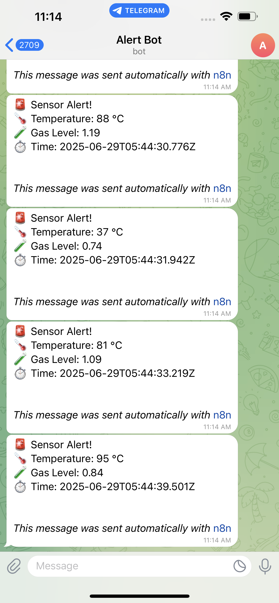

# Smart Sensor Monitoring System with n8n

This project implements a smart sensor monitoring system using n8n workflow automation. The system monitors environmental parameters and sends alerts when thresholds are exceeded.

## 🌟 Features

- Real-time monitoring of temperature and gas levels
- Automated Telegram alerts for critical conditions
- Configurable threshold values
- Simulated sensor data generation for testing
- Continuous monitoring with configurable intervals

## 🛠️ Prerequisites

- [n8n](https://n8n.io/) installed and running
- Telegram bot token and chat ID for notifications
- Basic understanding of n8n workflows

## 🚀 Installation

1. Clone this repository
2. Open n8n in your browser
3. Import the `smart-sensor-workflow.json` file into n8n
4. Configure your Telegram bot credentials in the workflow
5. Update the chat ID in the "Send a text message" node to your desired chat

## 🔧 Workflow Overview

### 1. Manual Trigger
- Starts the workflow execution
- Can be scheduled or triggered via webhook

### 2. Sensor Data Generation
- Simulates sensor readings for:
  - Temperature (°C)
  - Humidity (%)
  - Gas levels (0-1.2)
  - Timestamp

### 3. Condition Check
- Alerts are triggered if:
  - Temperature > 50°C **OR**
  - Gas level > 0.5

### 4. Alert System
- Sends Telegram notifications with:
  - Current temperature
  - Gas level
  - Timestamp

### 5. Wait Period
- Pauses for a specified duration before next check
- Default: 5 minutes

## ⚙️ Configuration

### Alert Thresholds
Update the "Check Parameters" node to modify:
- Temperature threshold (default: 50°C)
- Gas level threshold (default: 0.5)

### Notification Settings
Edit the "Send a text message" node to:
- Change the notification message format
- Update the chat ID
- Modify the Telegram bot token

## 📝 Example Alert Message
```
🚨 Sensor Alert!
🌡️ Temperature: 75 °C
🧪 Gas Level: 0.8
⏱️ Time: 2025-06-29T11:04:11+05:30
```

## 🎥 Live Demo

### Demo GIF


*Smart Sensor Monitoring System in Action*

### Screenshots

<div align="center">
  
  <p><em>Smart Sensor Monitoring Dashboard</em></p>
</div>

## 🤝 Contributing
Contributions are welcome! Please feel free to submit a Pull Request.

## 📄 License
This project is licensed under the MIT License - see the [LICENSE](LICENSE) file for details.

---

*Smart Sensor Monitoring System by [DHNSHYDV](https://github.com/DHNSHYDV)*
